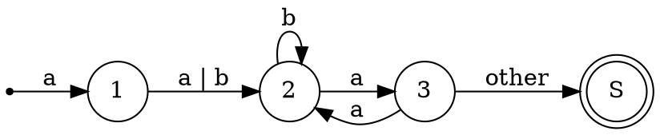

```graphviz
digraph finite_state_machine {
    rankdir=LR;
    size="10,5"

    node [shape = point ]; i
    node [shape = doublecircle]; S;

    node [shape = circle];
    i  -> 1 [ label = "a" ];
    1  -> 2  [ label = "a | b" ];
    2 -> 2  [ label = "b" ];
    2 -> 3  [ label = "a" ];
    3 -> 2 [ label = "a" ];
    3 -> S [ label = "other" ];
}
```