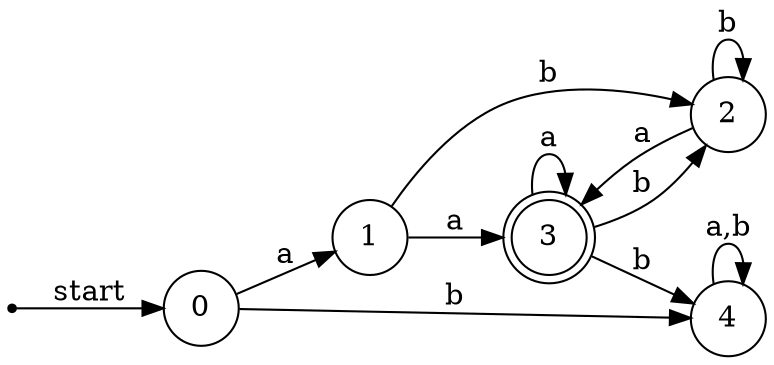
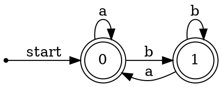
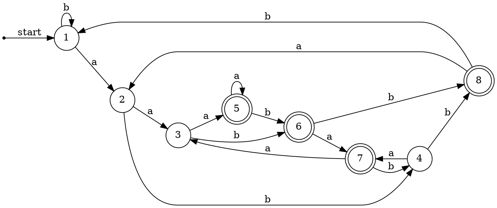
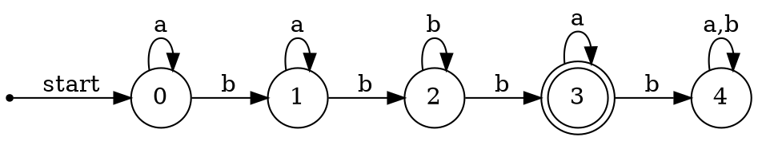
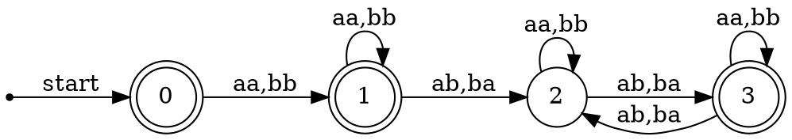

3.4.1: 给出识别练习3.3.2中各个正则表达式所描述的语言的状态转换图。 
解： 
1)a (a | b)* a

```graphviz
digraph finite_state_machine {
rankdir=LR;
size="10,5"

node [shape = point]; i;
node [shape = doublecircle]; 3;

node [shape = circle];
i -> 0 [ label = "start" ];
0 -> 1 [ label = "a" ];
0 -> 4 [ label = "b" ];
1 -> 2 [ label = "b" ];
1 -> 3 [ label = "a" ];
2 -> 2 [ label = "b" ];
2 -> 3 [ label = "a" ];
3 -> 3 [ label = "a" ];
3 -> 2 [ label = "b" ];
3 -> 4 [ label = "b" ];
4 -> 4 [ label = "a,b" ];
}
```
2)(($epsilon$ | a) b*)*

```graphviz
digraph finite_state_machine {
rankdir=LR;
size="10,5"

node [shape = point]; i;
node [shape = doublecircle]; 0;
node [shape = doublecircle]; 1;

node [shape = circle];
i -> 0 [ label = "start" ];
0 -> 0 [ label = "a" ];
0 -> 1 [ label = "b" ];
1 -> 1 [ label = "b" ];

1 -> 0 [ label = "a" ];

}
```
3) (a|b)*a(a|b)(a|b)

```graphviz
digraph finite_state_machine {
rankdir=LR;
size="10,5"
node [shape = point]; i;

node [shape = doublecircle]; 5;
node [shape = doublecircle]; 6;
node [shape = doublecircle]; 7;
node [shape = doublecircle]; 8;

node [shape = circle];
i -> 1 [ label = "start" ];
1 -> 1 [ label = "b" ];
1 -> 2 [ label = "a" ];
2 -> 3 [ label = "a" ];
2 -> 4 [ label = "b" ];

3 -> 5 [ label = "a" ];
3 -> 6 [ label = "b" ];
4 -> 7 [ label = "a" ];
4 -> 8 [ label = "b" ];

5 -> 5 [ label = "a" ];
5 -> 6 [ label = "b" ];

6 -> 7 [ label = "a" ];
6 -> 8 [ label = "b" ];

7 -> 3 [ label = "a" ];
7 -> 4 [ label = "b" ];

8 -> 2 [ label = "a" ];
8 -> 1 [ label = "b" ];
}
```

4) a*ba*ba*ba*

```graphviz
digraph finite_state_machine {
rankdir=LR;
size="10,5"

node [shape = point]; i;
node [shape = doublecircle]; 3;

node [shape = circle];
i -> 0 [ label = "start" ];
0 -> 0 [ label = "a" ];
0 -> 1 [ label = "b" ];
1 -> 1 [ label = "a" ];
1 -> 2 [ label = "b" ];
2 -> 2 [ label = "b" ];
2 -> 3 [ label = "b" ];
3 -> 3 [ label = "a" ];
3 -> 4 [ label = "b" ];
4 -> 4 [ label = "a,b" ];
}
```
5) (aa | bb)* ((ab | ba) (aa | bb)* (ab | ba) (aa | bb)*)*

```graphviz
digraph finite_state_machine {
rankdir=LR;
size="10,5"

node [shape = point]; i;
node [shape = doublecircle]; 0;
node [shape = doublecircle]; 1;
node [shape = doublecircle]; 3;

node [shape = circle];
i -> 0 [ label = "start" ];
0 -> 1 [ label = "aa,bb" ];
1 -> 1 [ label = "aa,bb" ];
1 -> 2 [ label = "ab,ba" ];
2 -> 2 [ label = "aa,bb" ];
2 -> 3 [ label = "ab,ba" ];
3 -> 3 [ label = "aa,bb" ];
3 -> 2 [ label = "ab,ba" ];
}
```
