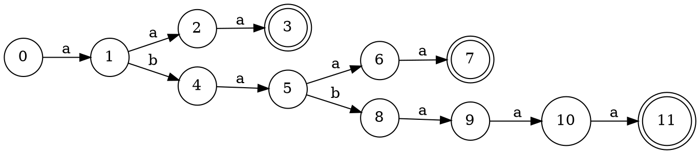
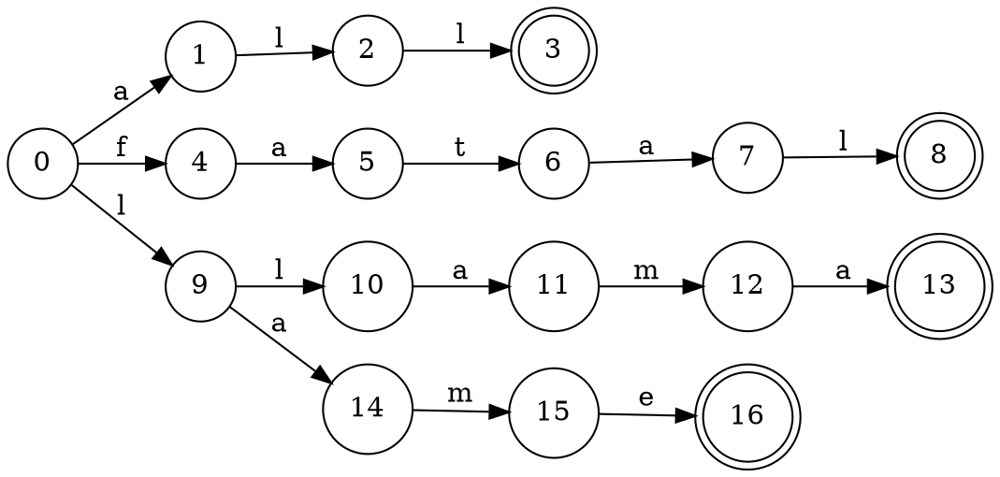
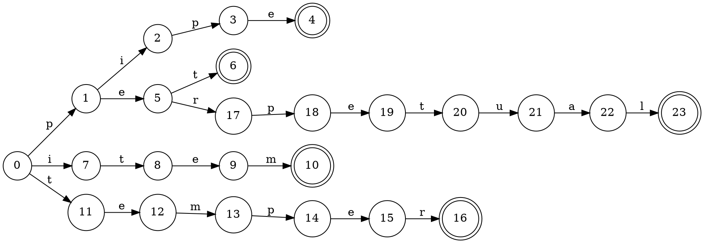

3.4.11: 为下面的关键字集合构造trie以及失效函数。
1) aaa,abaaa和ababaaa 
2) all,fall,fatal,llama和lame
3) pipe,pet,item,temper和perpetual

解：  
1) aaa,abaaa和ababaaa 

|s|1|2|3|4|5|6|7|8|9|10|11|
|---|---|---|---|---|---|---|---|---|---|---|---|
|f(s)|0|1|2|0|1|2|3|4|5|6|7|

2) all,fall,fatal,llama和lame

|s|1|2|3|4|5|6|7|8|9|10|11|12|13|14|15|16|
|---|---|---|---|---|---|---|---|---|---|---|---|---|---|---|---|---|
|f(s)|0|9|10|0|1|0|1|2|0|9|14|15|1|1|0|0|
3) pipe,pet,item,temper和perpetual

|s|1|2|3|4|5|6|7|8|9|10|11|12|13|14|15|16|17|18|19|20|21|22|23|
|---|---|---|---|---|---|---|---|---|---|---|---|---|---|---|---|---|---|---|---|---|---|---|---|
|f(s)|0|0|1|5|0|11|0|11|12|13|0|0|0|1|5|17|0|1|5|6|0|0|0|