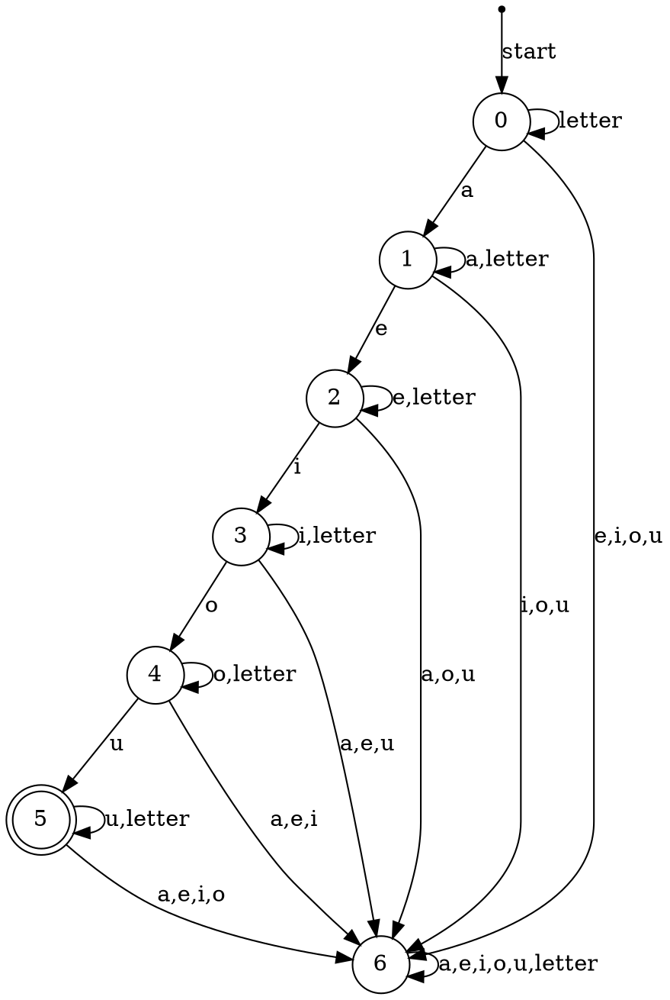

3.4.2: 给出识别练习3.3.5中各个正则表达式所描述的语言的状态转换图。
解：
1) $$
    letter \rightarrow [b-df-hj-np-tv-z]^*\
    L \rightarrow letter a^+ letter e^+ letter i^+ letter o^+ letter u^+ letter
$$

```graphviz
digraph finite_state_machine {
size="20,20"

node [shape = point]; i;
node [shape = doublecircle]; 5;

node [shape = circle];
i -> 0 [ label = "start" ];
0 -> 0 [ label = "letter" ];
0 -> 1 [ label = "a" ];
1 -> 1 [ label = "a,letter" ];
1 -> 2 [ label = "e" ];
2 -> 2 [ label = "e,letter" ];
2 -> 3 [ label = "i" ];
3 -> 3 [ label = "i,letter" ];
3 -> 4 [ label = "o" ];
4 -> 4 [ label = "o,letter" ];
4 -> 5 [ label = "u" ];
5 -> 5 [ label = "u,letter" ];
0 -> 6 [ label = "e,i,o,u" ];
1 -> 6 [ label = "i,o,u" ];
2 -> 6 [ label = "a,o,u" ];
3 -> 6 [ label = "a,e,u" ];
4 -> 6 [ label = "a,e,i" ];
5 -> 6 [ label = "a,e,i,o" ];
6 -> 6 [ label = "a,e,i,o,u,letter" ];
}
```