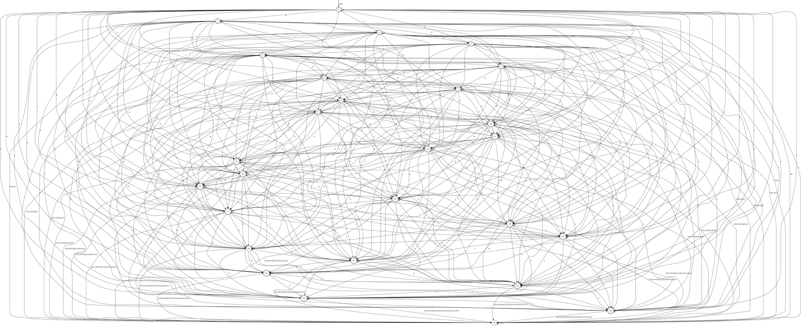

2) 
$$ 
L \rightarrow a^* b^* c^* d^* e^* f^* g^* h^* i^* j^* k^* l^* m^* n^* o^* p^* q^* m^* n^* o^* p^* q^* r^* s^* t^* u^* v^* w^* x^* y^* z^*
$$ 

```graphviz
digraph finite_state_machine {
size="1000,1000"

node [shape = point]; i;
node [shape = doublecircle]; 0;
node [shape = doublecircle]; 1;
node [shape = doublecircle]; 2;
node [shape = doublecircle]; 3;
node [shape = doublecircle]; 4;
node [shape = doublecircle]; 5;
node [shape = doublecircle]; 6;
node [shape = doublecircle]; 7;
node [shape = doublecircle]; 8;
node [shape = doublecircle]; 9;
node [shape = doublecircle]; 10;
node [shape = doublecircle]; 11;
node [shape = doublecircle]; 12;
node [shape = doublecircle]; 13;
node [shape = doublecircle]; 14;
node [shape = doublecircle]; 15;
node [shape = doublecircle]; 16;
node [shape = doublecircle]; 17;
node [shape = doublecircle]; 18;
node [shape = doublecircle]; 19;
node [shape = doublecircle]; 21;
node [shape = doublecircle]; 22;
node [shape = doublecircle]; 23;
node [shape = doublecircle]; 24;
node [shape = doublecircle]; 25;

node [shape = circle];
i -> 0 [ label = "start" ];
1 -> 26 [ label = "a" ];
2 -> 26 [ label = "a,b" ];
3 -> 26 [ label = "a,b,c" ];
4 -> 26 [ label = "a,b,c,d" ];
5 -> 26 [ label = "a,b,c,d,e" ];
6 -> 26 [ label = "a,b,c,d,e,f" ];
7 -> 26 [ label = "a,b,c,d,e,f,g" ];
8 -> 26 [ label = "a,b,c,d,e,f,g,h" ];
9 -> 26 [ label = "a,b,c,d,e,f,g,h,i" ];
10 -> 26 [ label = "a,b,c,d,e,f,g,h,i,j" ];
11 -> 26 [ label = "a,b,c,d,e,f,g,h,i,j,k" ];
12 -> 26 [ label = "a,b,c,d,e,f,g,h,i,j,k,l" ];
13 -> 26 [ label = "a,b,c,d,e,f,g,h,i,j,k,l,m" ];
14 -> 26 [ label = "a,b,c,d,e,f,g,h,i,j,k,l,m,n" ];
15 -> 26 [ label = "a,b,c,d,e,f,g,h,i,j,k,l,m,n,o" ];
16 -> 26 [ label = "a,b,c,d,e,f,g,h,i,j,k,l,m,n,o,p" ];
17 -> 26 [ label = "a,b,c,d,e,f,g,h,i,j,k,l,m,n,o,p,q" ];
18 -> 26 [ label = "a,b,c,d,e,f,g,h,i,j,k,l,m,n,o,p,q,r" ];
19 -> 26 [ label = "a,b,c,d,e,f,g,h,i,j,k,l,m,n,o,p,q,r,s" ];
20 -> 26 [ label = "a,b,c,d,e,f,g,h,i,j,k,l,m,n,o,p,q,r,s,t" ];
21 -> 26 [ label = "a,b,c,d,e,f,g,h,i,j,k,l,m,n,o,p,q,r,s,t,u" ];
22 -> 26 [ label = "a,b,c,d,e,f,g,h,i,j,k,l,m,n,o,p,q,r,s,t,u,v" ];
23 -> 26 [ label = "a,b,c,d,e,f,g,h,i,j,k,l,m,n,o,p,q,r,s,t,u,v,w" ];
24 -> 26 [ label = "a,b,c,d,e,f,g,h,i,j,k,l,m,n,o,p,q,r,s,t,u,v,w,x" ];
25 -> 26 [ label = "a,b,c,d,e,f,g,h,i,j,k,l,m,n,o,p,q,r,s,t,u,v,w,x,y" ];
26 -> 26 [ label = "letter" ];
0 -> 0 [ label = "a" ];
0 -> 1 [ label = "b" ];
0 -> 2 [ label = "c" ];
0 -> 3 [ label = "d" ];
0 -> 4 [ label = "e" ];
0 -> 5 [ label = "f" ];
0 -> 6 [ label = "g" ];
0 -> 7 [ label = "h" ];
0 -> 8 [ label = "i" ];
0 -> 9 [ label = "j" ];
0 -> 10 [ label = "k" ];
0 -> 11 [ label = "l" ];
0 -> 12 [ label = "m" ];
0 -> 13 [ label = "n" ];
0 -> 14 [ label = "o" ];
0 -> 15 [ label = "p" ];
0 -> 16 [ label = "q" ];
0 -> 17 [ label = "r" ];
0 -> 18 [ label = "s" ];
0 -> 19 [ label = "t" ];
0 -> 20 [ label = "u" ];
0 -> 21 [ label = "v" ];
0 -> 22 [ label = "w" ];
0 -> 23 [ label = "x" ];
0 -> 24 [ label = "y" ];
0 -> 25 [ label = "z" ];
1 -> 1 [ label = "b" ];
1 -> 2 [ label = "c" ];
1 -> 3 [ label = "d" ];
1 -> 4 [ label = "e" ];
1 -> 5 [ label = "f" ];
1 -> 6 [ label = "g" ];
1 -> 7 [ label = "h" ];
1 -> 8 [ label = "i" ];
1 -> 9 [ label = "j" ];
1 -> 10 [ label = "k" ];
1 -> 11 [ label = "l" ];
1 -> 12 [ label = "m" ];
1 -> 13 [ label = "n" ];
1 -> 14 [ label = "o" ];
1 -> 15 [ label = "p" ];
1 -> 16 [ label = "q" ];
1 -> 17 [ label = "r" ];
1 -> 18 [ label = "s" ];
1 -> 19 [ label = "t" ];
1 -> 20 [ label = "u" ];
1 -> 21 [ label = "v" ];
1 -> 22 [ label = "w" ];
1 -> 23 [ label = "x" ];
1 -> 24 [ label = "y" ];
1 -> 25 [ label = "z" ];
2 -> 2 [ label = "c" ];
2 -> 3 [ label = "d" ];
2 -> 4 [ label = "e" ];
2 -> 5 [ label = "f" ];
2 -> 6 [ label = "g" ];
2 -> 7 [ label = "h" ];
2 -> 8 [ label = "i" ];
2 -> 9 [ label = "j" ];
2 -> 10 [ label = "k" ];
2 -> 11 [ label = "l" ];
2 -> 12 [ label = "m" ];
2 -> 13 [ label = "n" ];
2 -> 14 [ label = "o" ];
2 -> 15 [ label = "p" ];
2 -> 16 [ label = "q" ];
2 -> 17 [ label = "r" ];
2 -> 18 [ label = "s" ];
2 -> 19 [ label = "t" ];
2 -> 20 [ label = "u" ];
2 -> 21 [ label = "v" ];
2 -> 22 [ label = "w" ];
2 -> 23 [ label = "x" ];
2 -> 24 [ label = "y" ];
2 -> 25 [ label = "z" ];
3 -> 3 [ label = "d" ];
3 -> 4 [ label = "e" ];
3 -> 5 [ label = "f" ];
3 -> 6 [ label = "g" ];
3 -> 7 [ label = "h" ];
3 -> 8 [ label = "i" ];
3 -> 9 [ label = "j" ];
3 -> 10 [ label = "k" ];
3 -> 11 [ label = "l" ];
3 -> 12 [ label = "m" ];
3 -> 13 [ label = "n" ];
3 -> 14 [ label = "o" ];
3 -> 15 [ label = "p" ];
3 -> 16 [ label = "q" ];
3 -> 17 [ label = "r" ];
3 -> 18 [ label = "s" ];
3 -> 19 [ label = "t" ];
3 -> 20 [ label = "u" ];
3 -> 21 [ label = "v" ];
3 -> 22 [ label = "w" ];
3 -> 23 [ label = "x" ];
3 -> 24 [ label = "y" ];
3 -> 25 [ label = "z" ];
4 -> 4 [ label = "e" ];
4 -> 5 [ label = "f" ];
4 -> 6 [ label = "g" ];
4 -> 7 [ label = "h" ];
4 -> 8 [ label = "i" ];
4 -> 9 [ label = "j" ];
4 -> 10 [ label = "k" ];
4 -> 11 [ label = "l" ];
4 -> 12 [ label = "m" ];
4 -> 13 [ label = "n" ];
4 -> 14 [ label = "o" ];
4 -> 15 [ label = "p" ];
4 -> 16 [ label = "q" ];
4 -> 17 [ label = "r" ];
4 -> 18 [ label = "s" ];
4 -> 19 [ label = "t" ];
4 -> 20 [ label = "u" ];
4 -> 21 [ label = "v" ];
4 -> 22 [ label = "w" ];
4 -> 23 [ label = "x" ];
4 -> 24 [ label = "y" ];
4 -> 25 [ label = "z" ];
5 -> 5 [ label = "f" ];
5 -> 6 [ label = "g" ];
5 -> 7 [ label = "h" ];
5 -> 8 [ label = "i" ];
5 -> 9 [ label = "j" ];
5 -> 10 [ label = "k" ];
5 -> 11 [ label = "l" ];
5 -> 12 [ label = "m" ];
5 -> 13 [ label = "n" ];
5 -> 14 [ label = "o" ];
5 -> 15 [ label = "p" ];
5 -> 16 [ label = "q" ];
5 -> 17 [ label = "r" ];
5 -> 18 [ label = "s" ];
5 -> 19 [ label = "t" ];
5 -> 20 [ label = "u" ];
5 -> 21 [ label = "v" ];
5 -> 22 [ label = "w" ];
5 -> 23 [ label = "x" ];
5 -> 24 [ label = "y" ];
5 -> 25 [ label = "z" ];
6 -> 6 [ label = "g" ];
6 -> 7 [ label = "h" ];
6 -> 8 [ label = "i" ];
6 -> 9 [ label = "j" ];
6 -> 10 [ label = "k" ];
6 -> 11 [ label = "l" ];
6 -> 12 [ label = "m" ];
6 -> 13 [ label = "n" ];
6 -> 14 [ label = "o" ];
6 -> 15 [ label = "p" ];
6 -> 16 [ label = "q" ];
6 -> 17 [ label = "r" ];
6 -> 18 [ label = "s" ];
6 -> 19 [ label = "t" ];
6 -> 20 [ label = "u" ];
6 -> 21 [ label = "v" ];
6 -> 22 [ label = "w" ];
6 -> 23 [ label = "x" ];
6 -> 24 [ label = "y" ];
6 -> 25 [ label = "z" ];
7 -> 7 [ label = "h" ];
7 -> 8 [ label = "i" ];
7 -> 9 [ label = "j" ];
7 -> 10 [ label = "k" ];
7 -> 11 [ label = "l" ];
7 -> 12 [ label = "m" ];
7 -> 13 [ label = "n" ];
7 -> 14 [ label = "o" ];
7 -> 15 [ label = "p" ];
7 -> 16 [ label = "q" ];
7 -> 17 [ label = "r" ];
7 -> 18 [ label = "s" ];
7 -> 19 [ label = "t" ];
7 -> 20 [ label = "u" ];
7 -> 21 [ label = "v" ];
7 -> 22 [ label = "w" ];
7 -> 23 [ label = "x" ];
7 -> 24 [ label = "y" ];
7 -> 25 [ label = "z" ];
8 -> 8 [ label = "i" ];
8 -> 9 [ label = "j" ];
8 -> 10 [ label = "k" ];
8 -> 11 [ label = "l" ];
8 -> 12 [ label = "m" ];
8 -> 13 [ label = "n" ];
8 -> 14 [ label = "o" ];
8 -> 15 [ label = "p" ];
8 -> 16 [ label = "q" ];
8 -> 17 [ label = "r" ];
8 -> 18 [ label = "s" ];
8 -> 19 [ label = "t" ];
8 -> 20 [ label = "u" ];
8 -> 21 [ label = "v" ];
8 -> 22 [ label = "w" ];
8 -> 23 [ label = "x" ];
8 -> 24 [ label = "y" ];
8 -> 25 [ label = "z" ];
9 -> 9 [ label = "j" ];
9 -> 10 [ label = "k" ];
9 -> 11 [ label = "l" ];
9 -> 12 [ label = "m" ];
9 -> 13 [ label = "n" ];
9 -> 14 [ label = "o" ];
9 -> 15 [ label = "p" ];
9 -> 16 [ label = "q" ];
9 -> 17 [ label = "r" ];
9 -> 18 [ label = "s" ];
9 -> 19 [ label = "t" ];
9 -> 20 [ label = "u" ];
9 -> 21 [ label = "v" ];
9 -> 22 [ label = "w" ];
9 -> 23 [ label = "x" ];
9 -> 24 [ label = "y" ];
9 -> 25 [ label = "z" ];
10 -> 10 [ label = "k" ];
10 -> 11 [ label = "l" ];
10 -> 12 [ label = "m" ];
10 -> 13 [ label = "n" ];
10 -> 14 [ label = "o" ];
10 -> 15 [ label = "p" ];
10 -> 16 [ label = "q" ];
10 -> 17 [ label = "r" ];
10 -> 18 [ label = "s" ];
10 -> 19 [ label = "t" ];
10 -> 20 [ label = "u" ];
10 -> 21 [ label = "v" ];
10 -> 22 [ label = "w" ];
10 -> 23 [ label = "x" ];
10 -> 24 [ label = "y" ];
10 -> 25 [ label = "z" ];
11 -> 11 [ label = "l" ];
11 -> 12 [ label = "m" ];
11 -> 13 [ label = "n" ];
11 -> 14 [ label = "o" ];
11 -> 15 [ label = "p" ];
11 -> 16 [ label = "q" ];
11 -> 17 [ label = "r" ];
11 -> 18 [ label = "s" ];
11 -> 19 [ label = "t" ];
11 -> 20 [ label = "u" ];
11 -> 21 [ label = "v" ];
11 -> 22 [ label = "w" ];
11 -> 23 [ label = "x" ];
11 -> 24 [ label = "y" ];
11 -> 25 [ label = "z" ];
12 -> 12 [ label = "m" ];
12 -> 13 [ label = "n" ];
12 -> 14 [ label = "o" ];
12 -> 15 [ label = "p" ];
12 -> 16 [ label = "q" ];
12 -> 17 [ label = "r" ];
12 -> 18 [ label = "s" ];
12 -> 19 [ label = "t" ];
12 -> 20 [ label = "u" ];
12 -> 21 [ label = "v" ];
12 -> 22 [ label = "w" ];
12 -> 23 [ label = "x" ];
12 -> 24 [ label = "y" ];
12 -> 25 [ label = "z" ];
13 -> 13 [ label = "n" ];
13 -> 14 [ label = "o" ];
13 -> 15 [ label = "p" ];
13 -> 16 [ label = "q" ];
13 -> 17 [ label = "r" ];
13 -> 18 [ label = "s" ];
13 -> 19 [ label = "t" ];
13 -> 20 [ label = "u" ];
13 -> 21 [ label = "v" ];
13 -> 22 [ label = "w" ];
13 -> 23 [ label = "x" ];
13 -> 24 [ label = "y" ];
13 -> 25 [ label = "z" ];
14 -> 14 [ label = "o" ];
14 -> 15 [ label = "p" ];
14 -> 16 [ label = "q" ];
14 -> 17 [ label = "r" ];
14 -> 18 [ label = "s" ];
14 -> 19 [ label = "t" ];
14 -> 20 [ label = "u" ];
14 -> 21 [ label = "v" ];
14 -> 22 [ label = "w" ];
14 -> 23 [ label = "x" ];
14 -> 24 [ label = "y" ];
14 -> 25 [ label = "z" ];
15 -> 15 [ label = "p" ];
15 -> 16 [ label = "q" ];
15 -> 17 [ label = "r" ];
15 -> 18 [ label = "s" ];
15 -> 19 [ label = "t" ];
15 -> 20 [ label = "u" ];
15 -> 21 [ label = "v" ];
15 -> 22 [ label = "w" ];
15 -> 23 [ label = "x" ];
15 -> 24 [ label = "y" ];
15 -> 25 [ label = "z" ];
16 -> 16 [ label = "q" ];
16 -> 17 [ label = "r" ];
16 -> 18 [ label = "s" ];
16 -> 19 [ label = "t" ];
16 -> 20 [ label = "u" ];
16 -> 21 [ label = "v" ];
16 -> 22 [ label = "w" ];
16 -> 23 [ label = "x" ];
16 -> 24 [ label = "y" ];
16 -> 25 [ label = "z" ];
17 -> 17 [ label = "r" ];
17 -> 18 [ label = "s" ];
17 -> 19 [ label = "t" ];
17 -> 20 [ label = "u" ];
17 -> 21 [ label = "v" ];
17 -> 22 [ label = "w" ];
17 -> 23 [ label = "x" ];
17 -> 24 [ label = "y" ];
17 -> 25 [ label = "z" ];
18 -> 18 [ label = "s" ];
18 -> 19 [ label = "t" ];
18 -> 20 [ label = "u" ];
18 -> 21 [ label = "v" ];
18 -> 22 [ label = "w" ];
18 -> 23 [ label = "x" ];
18 -> 24 [ label = "y" ];
18 -> 25 [ label = "z" ];
19 -> 19 [ label = "t" ];
19 -> 20 [ label = "u" ];
19 -> 21 [ label = "v" ];
19 -> 22 [ label = "w" ];
19 -> 23 [ label = "x" ];
19 -> 24 [ label = "y" ];
19 -> 25 [ label = "z" ];
20 -> 20 [ label = "u" ];
20 -> 21 [ label = "v" ];
20 -> 22 [ label = "w" ];
20 -> 23 [ label = "x" ];
20 -> 24 [ label = "y" ];
20 -> 25 [ label = "z" ];
21 -> 21 [ label = "v" ];
21 -> 22 [ label = "w" ];
21 -> 23 [ label = "x" ];
21 -> 24 [ label = "y" ];
21 -> 25 [ label = "z" ];
22 -> 22 [ label = "w" ];
22 -> 23 [ label = "x" ];
22 -> 24 [ label = "y" ];
22 -> 25 [ label = "z" ];
23 -> 23 [ label = "x" ];
23 -> 24 [ label = "y" ];
23 -> 25 [ label = "z" ];
24 -> 24 [ label = "y" ];
24 -> 25 [ label = "z" ];
25 -> 25 [ label = "z" ];
}

```
