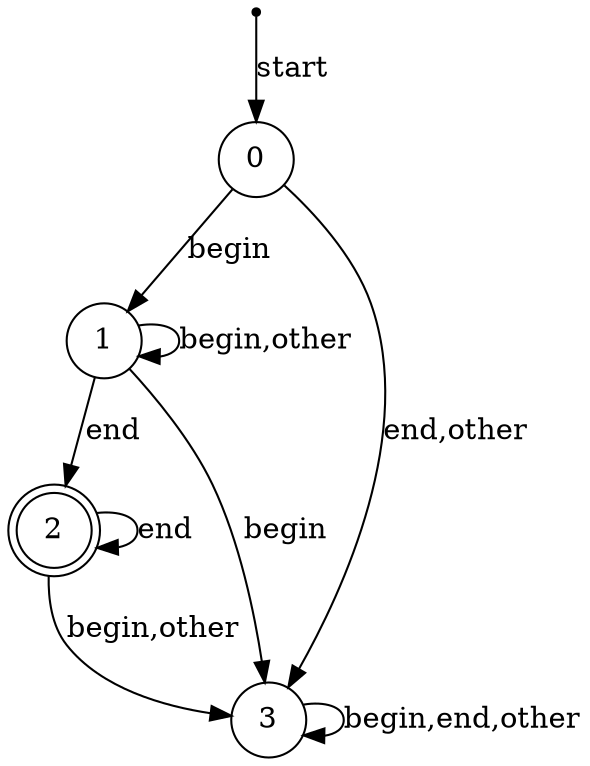

3) 
$$
    begin \rightarrow /* \\
    end \rightarrow */ \\
    letter_digit \rightarrow [A-Za-z0-9] \\
    quote \rightarrow ' \\
    dquote \rightarrow " \\
    plus \rightarrow + \\
    minus \rightarrow - \\
    star \rightarrow * \\
    div \rightarrow / \\
    equal \rightarrow = \\
    lparenthesis \rightarrow ( \\
    rparenthesis \rightarrow ) \\
    lbracket \rightarrow [ \\
    rbracket \rightarrow ] \\
    percent \rightarrow \% \\
    dollar \rightarrow \$ \\
    L \rightarrow begin (letter_digit|'end'|quote|dquote|plus|minus|star|div|equal|lparenthesis|rparenthesis|lbracket|rbracket|!|@|_|dollar|percent|~|)^* end

$$

4) 
$$
1digit0 = 0?\\
1digit1 = 1?\\
1digit2 = 2?\\
1digit3 = 3?\\
1digit4 = 4?\\
1digit5 = 5?\\
1digit6 = 6?\\
1digit7 = 7?\\
1digit8 = 8?\\
1digit9 = 9?\\
2digit1 = 0?1?\\
2digit2 = 0?2?\\
10digit \rightarrow 0?[1-9]?
$$

5) 
$$

$$
6) 
$$
    L \rightarrow ((aa)?)^*b((bb)?)^* 
$$

7) $$

$$

8) 
$$
    L \rightarrow (a^*|b^*)(aba?)^*a^*
$$

9) 
$$
    L \rightarrow b^*a^*b?
$$

