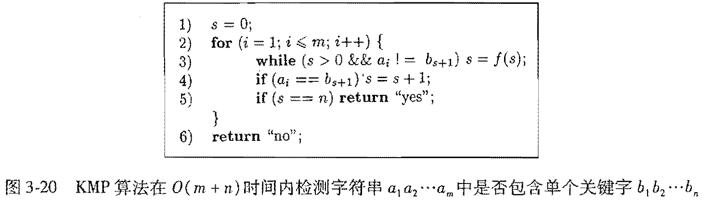

3.4.7 ：说明图3-20中的算法可以正确地指出输入关键字是否为一个给定字符串的子串。

提示：对i进行归纳。说明对于所有的i, 在第四行运行后s的值是那些既是$a_1 a_2...a_i$的后缀又是该关键字的前缀的字符串中最长字符串的长度

证明：
1) $i = 1$时,  
   a. 若$a_1 = b_1$，则$s=1$,此时$b_1$既是$a_1$的后缀，又是其最长前缀，即在第四行运行后s的值是那些既是$a_1 a_2...a_i$的后缀又是该关键字的前缀的字符串中最长字符串的长度  
   b. 若$a_1 \ne b_1$，则$s=0$,在第四行运行后s的值是那些既是$a_1 a_2...a_i$的后缀又是该关键字的前缀的字符串中最长字符串的长度  
2) 假设$i = x \le m$时,在第四行运行后s的值是那些既是$a_1 a_2...a_i$的后缀又是该关键字的前缀的字符串中最长字符串的长度,则  
