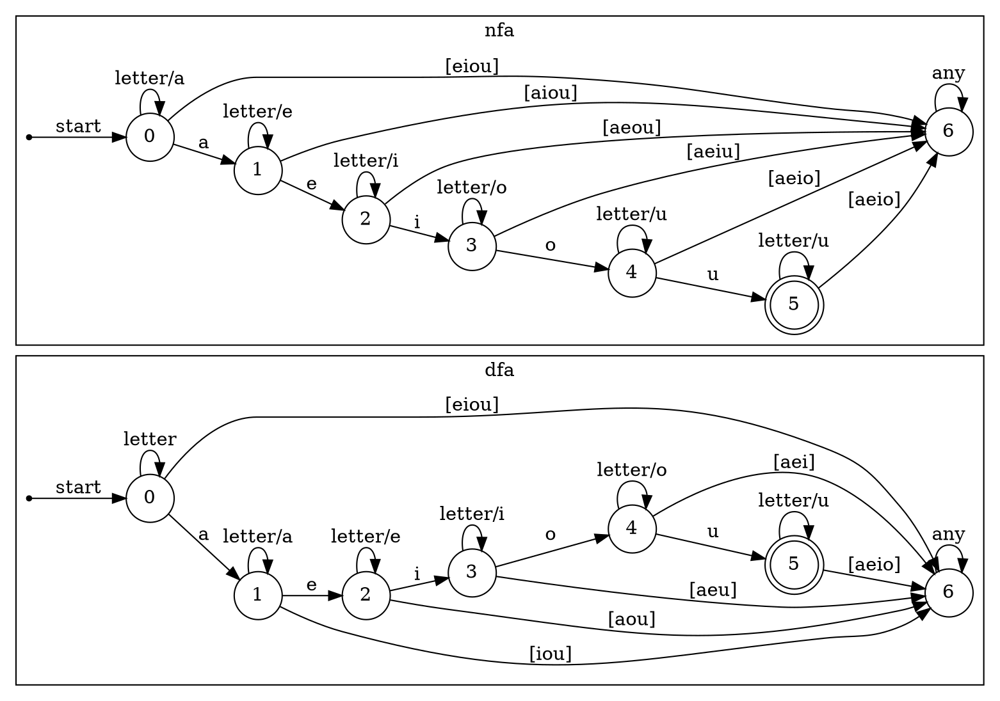

3.6.2: 为练习3.3.5 中的每一个语言设计一个DFA或NFA。
解：
1) 包含5个元音的所有小写字母串，这些串中的元音按顺序出现
$$
    letter \rightarrow [b-df-hj-np-tv-z]\\
    L \rightarrow letter^* a^+ letter^* e^+ letter^* i^+ letter^* o^+ letter^* u^+ letter^*
$$

