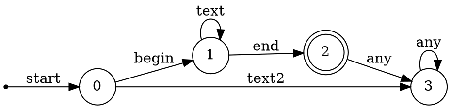

3.6.2: 为练习3.3.5 中的每一个语言设计一个DFA或NFA。
解：

3) 注释即/*和*/之间的串，且串中没有不在双引号(")中的*/
$$
    begin \rightarrow  \\
    end \rightarrow */ \\
    text \rightarrow [\text{\textasciicircum}end]|"*/"\\
    text2 \rightarrow [\text{\textasciicircum}begin]
    L \rightarrow begin text^* end
$$

