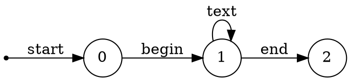

3.6.2: 为练习3.3.5 中的每一个语言设计一个DFA或NFA。
解：

4) 所有不重复的数位组成的串。提示：首先尝试解决只含有少量数位（比如|0，1，2|）的数位串
$$
1digit0 = 0?\\
1digit1 = 1?\\
1digit2 = 2?\\
1digit3 = 3?\\
1digit4 = 4?\\
1digit5 = 5?\\
1digit6 = 6?\\
1digit7 = 7?\\
1digit8 = 8?\\
1digit9 = 9?\\
2digit1 = 0?1?\\
2digit2 = 0?2?\\
10digit0 \rightarrow 0?[1-9]?
$$
