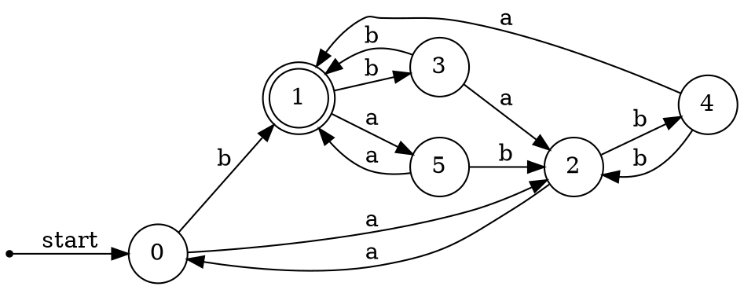

3.6.2: 为练习3.3.5 中的每一个语言设计一个DFA或NFA。
解：

6) 所有由偶数个a和奇数个b构成的串
$$
    L \rightarrow ((aa)?)^*b((bb)?)^* 
$$

```graphviz
    digraph finite_state_machine{
        rankdir=LR;
        node [shape=point] start;
        node [shape=doublecircle] 1;
        node [shape=circle];

        start -> 0 [label="start"];
        0 -> 1 [label="b"];
        0 -> 2 [label="a"];
        2 -> 0 [label="a"];
        2 -> 4 [label="b"];
        1 -> 5 [label="a"];
        1 -> 3 [label="b"];
        3 -> 1 [label="b"];
        3 -> 2 [label="a"];
        4 -> 1 [label="a"];
        4 -> 2 [label="b"];
        5 -> 1 [label="a"];
        5 -> 2 [label="b"];
    }
```