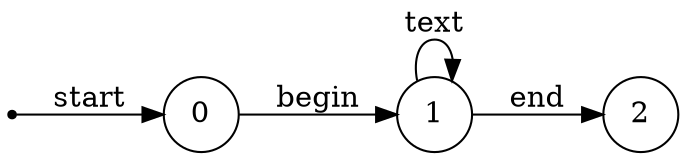

3.6.2: 为练习3.3.5 中的每一个语言设计一个DFA或NFA。
解：

7) 以非正式方式表示的国际象棋的步法的集合，如p-k4或kbp×qn
$$

$$
$$

```graphviz
    digraph finite_state_machine{
        rankdir=LR;
        node [shape=point] start;
        node [shape=circle];
        start -> 0 [label="start"];
        0 -> 1 [label="begin"];
        1 -> 1 [label="text"];
        1 -> 2 [label="end"];
    }
```
