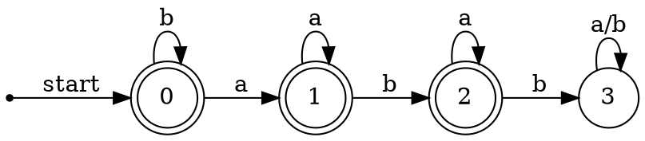

3.6.2: 为练习3.3.5 中的每一个语言设计一个DFA或NFA。
解：

9) 所有由a和b组成且不含子序列abb的串
$$
    L \rightarrow b^*a^*b?
$$

```graphviz
    digraph finite_state_machine{
        rankdir=LR;
        node [shape=point] start;
        node [shape=circle] 3;
        node [shape=doublecircle];

        start -> 0 [label="start"];
        0 -> 0 [label="b"];
        0 -> 1 [label="a"];
        1 -> 1 [label="a"];
        1 -> 2 [label="b"];
        2 -> 3 [label="b"];
        2 -> 2 [label="a"];
        3 -> 3 [label="a/b"];
    }
```