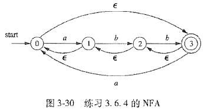

3.6.4: 找出图3-30所示的NFA中所有标号为aabb的路径。这个NFA接受aabb吗？

解：

$a1:0\stackrel{a}{\longrightarrow}1$  
$a2:3\stackrel{a}{\longrightarrow}0$  
$b1:1\stackrel{a}{\longrightarrow}2$    
$b1:2\stackrel{a}{\longrightarrow}3$  

1. $0\stackrel{a}{\longrightarrow}1\stackrel{\epsilon}{\longrightarrow}0\stackrel{a}{\longrightarrow}1\stackrel{b}{\longrightarrow}2\stackrel{\epsilon}{\longrightarrow}1\stackrel{b}{\longrightarrow}2\stackrel{\epsilon}{\longrightarrow}1\stackrel{\epsilon}{\longrightarrow}0\stackrel{\epsilon}{\longrightarrow}3$

2. $0\stackrel{a}{\longrightarrow}1\stackrel{\epsilon}{\longrightarrow}0\stackrel{a}{\longrightarrow}1\stackrel{b}{\longrightarrow}2\stackrel{b}{\longrightarrow}3$

3. $0\stackrel{a}{\longrightarrow}1\stackrel{\epsilon}{\longrightarrow}0\stackrel{a}{\longrightarrow}1\stackrel{\epsilon}{\longrightarrow}0\stackrel{\epsilon}{\longrightarrow}3\stackrel{\epsilon}{\longrightarrow}2\stackrel{b}{\longrightarrow}3\stackrel{\epsilon}{\longrightarrow}2\stackrel{\epsilon}{\longrightarrow}1\stackrel{b}{\longrightarrow}2\stackrel{\epsilon}{\longrightarrow}1\stackrel{\epsilon}{\longrightarrow}0\stackrel{\epsilon}{\longrightarrow}3$

4. $0\stackrel{a}{\longrightarrow}1\stackrel{\epsilon}{\longrightarrow}0\stackrel{a}{\longrightarrow}1\stackrel{\epsilon}{\longrightarrow}0\stackrel{\epsilon}{\longrightarrow}3\stackrel{\epsilon}{\longrightarrow}2\stackrel{b}{\longrightarrow}3\stackrel{\epsilon}{\longrightarrow}2\stackrel{b}{\longrightarrow}3$

5. $0\stackrel{a}{\longrightarrow}1\stackrel{\epsilon}{\longrightarrow}0\stackrel{\epsilon}{\longrightarrow}3\stackrel{a}{\longrightarrow}0\stackrel{\epsilon}{\longrightarrow}3\stackrel{\epsilon}{\longrightarrow}2\stackrel{\epsilon}{\longrightarrow}1\stackrel{b}{\longrightarrow}2\stackrel{\epsilon}{\longrightarrow}1\stackrel{b}{\longrightarrow}2\stackrel{\epsilon}{\longrightarrow}1\stackrel{\epsilon}{\longrightarrow}0\stackrel{\epsilon}{\longrightarrow}3$

6. $0\stackrel{a}{\longrightarrow}1\stackrel{\epsilon}{\longrightarrow}0\stackrel{\epsilon}{\longrightarrow}3\stackrel{a}{\longrightarrow}0\stackrel{\epsilon}{\longrightarrow}3\stackrel{\epsilon}{\longrightarrow}2\stackrel{\epsilon}{\longrightarrow}1\stackrel{b}{\longrightarrow}2\stackrel{b}{\longrightarrow}3$

7. $0\stackrel{a}{\longrightarrow}1\stackrel{\epsilon}{\longrightarrow}0\stackrel{\epsilon}{\longrightarrow}3\stackrel{a}{\longrightarrow}0\stackrel{\epsilon}{\longrightarrow}2\stackrel{b}{\longrightarrow}3\stackrel{\epsilon}{\longrightarrow}2\stackrel{b}{\longrightarrow}3$

8. $0\stackrel{a}{\longrightarrow}1\stackrel{\epsilon}{\longrightarrow}0\stackrel{\epsilon}{\longrightarrow}3\stackrel{a}{\longrightarrow}0\stackrel{\epsilon}{\longrightarrow}2\stackrel{b}{\longrightarrow}3\stackrel{\epsilon}{\longrightarrow}2\stackrel{\epsilon}{\longrightarrow}1\stackrel{b}{\longrightarrow}2\stackrel{\epsilon}{\longrightarrow}1\stackrel{\epsilon}{\longrightarrow}0\stackrel{\epsilon}{\longrightarrow}3$

9. $0\stackrel{\epsilon}{\longrightarrow}3\stackrel{a}{\longrightarrow}0\stackrel{a}{\longrightarrow}1\stackrel{b}{\longrightarrow}2\stackrel{\epsilon}{\longrightarrow}1\stackrel{b}{\longrightarrow}2\stackrel{\epsilon}{\longrightarrow}1\stackrel{\epsilon}{\longrightarrow}0\stackrel{\epsilon}{\longrightarrow}3$

10. $0\stackrel{\epsilon}{\longrightarrow}3\stackrel{a}{\longrightarrow}0\stackrel{a}{\longrightarrow}1\stackrel{b}{\longrightarrow}2\stackrel{b}{\longrightarrow}3$

11. $0\stackrel{\epsilon}{\longrightarrow}3\stackrel{a}{\longrightarrow}0\stackrel{a}{\longrightarrow}1\stackrel{\epsilon}{\longrightarrow}2\stackrel{b}{\longrightarrow}3\stackrel{\epsilon}{\longrightarrow}2\stackrel{b}{\longrightarrow}3$

12. $0\stackrel{\epsilon}{\longrightarrow}3\stackrel{a}{\longrightarrow}0\stackrel{a}{\longrightarrow}1\stackrel{\epsilon}{\longrightarrow}0\stackrel{\epsilon}{\longrightarrow}3\stackrel{\epsilon}{\longrightarrow}2\stackrel{b}{\longrightarrow}3\stackrel{\epsilon}{\longrightarrow}2\stackrel{\epsilon}{\longrightarrow}1\stackrel{b}{\longrightarrow}2\stackrel{\epsilon}{\longrightarrow}1\stackrel{\epsilon}{\longrightarrow}0\stackrel{\epsilon}{\longrightarrow}3$

13. $0\stackrel{\epsilon}{\longrightarrow}3\stackrel{a}{\longrightarrow}0\stackrel{\epsilon}{\longrightarrow}3\stackrel{a}{\longrightarrow}0\stackrel{\epsilon}{\longrightarrow}3\stackrel{\epsilon}{\longrightarrow}2\stackrel{\epsilon}{\longrightarrow}1\stackrel{b}{\longrightarrow}2\stackrel{\epsilon}{\longrightarrow}1\stackrel{b}{\longrightarrow}2\stackrel{\epsilon}{\longrightarrow}1\stackrel{\epsilon}{\longrightarrow}0\stackrel{\epsilon}{\longrightarrow}3$

14. $0\stackrel{\epsilon}{\longrightarrow}3\stackrel{a}{\longrightarrow}0\stackrel{\epsilon}{\longrightarrow}3\stackrel{a}{\longrightarrow}0\stackrel{\epsilon}{\longrightarrow}3\stackrel{\epsilon}{\longrightarrow}2\stackrel{\epsilon}{\longrightarrow}1\stackrel{b}{\longrightarrow}2\stackrel{b}{\longrightarrow}3$

15. $0\stackrel{\epsilon}{\longrightarrow}3\stackrel{a}{\longrightarrow}0\stackrel{\epsilon}{\longrightarrow}3\stackrel{a}{\longrightarrow}0\stackrel{\epsilon}{\longrightarrow}2\stackrel{b}{\longrightarrow}3\stackrel{\epsilon}{\longrightarrow}2\stackrel{b}{\longrightarrow}3$

16. $0\stackrel{\epsilon}{\longrightarrow}3\stackrel{a}{\longrightarrow}0\stackrel{\epsilon}{\longrightarrow}3\stackrel{a}{\longrightarrow}0\stackrel{\epsilon}{\longrightarrow}2\stackrel{b}{\longrightarrow}3\stackrel{\epsilon}{\longrightarrow}2\stackrel{\epsilon}{\longrightarrow}1\stackrel{b}{\longrightarrow}2\stackrel{\epsilon}{\longrightarrow}1\stackrel{\epsilon}{\longrightarrow}0\stackrel{\epsilon}{\longrightarrow}3$

从各个状态出发回到相同状态的无字符路径为：
- $0:0\stackrel{\epsilon}{\longrightarrow}3\stackrel{\epsilon}{\longrightarrow}2\stackrel{\epsilon}{\longrightarrow}1\stackrel{\epsilon}{\longrightarrow}0$
- $1:1\stackrel{\epsilon}{\longrightarrow}0\stackrel{\epsilon}{\longrightarrow}3\stackrel{\epsilon}{\longrightarrow}2\stackrel{\epsilon}{\longrightarrow}1$
- $2:2\stackrel{\epsilon}{\longrightarrow}1\stackrel{\epsilon}{\longrightarrow}0\stackrel{\epsilon}{\longrightarrow}3\stackrel{\epsilon}{\longrightarrow}2$
- $3:3\stackrel{\epsilon}{\longrightarrow}2\stackrel{\epsilon}{\longrightarrow}1\stackrel{\epsilon}{\longrightarrow}0\stackrel{\epsilon}{\longrightarrow}3$

所有标号为aabb的路径为以上16种路径在其中任意个状态后增加任意个相同状态及相关无字符路径所形成的路径的集合