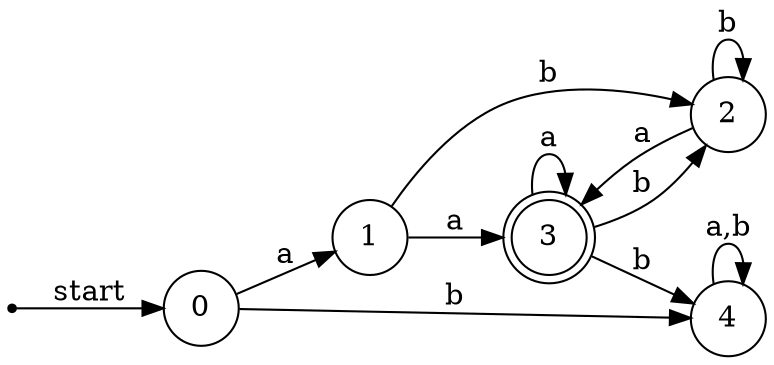
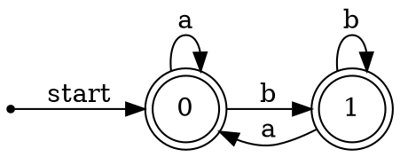
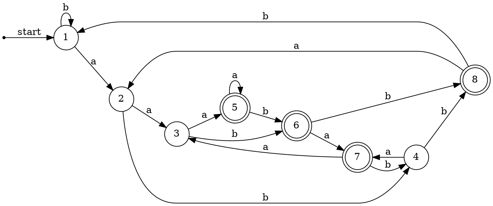
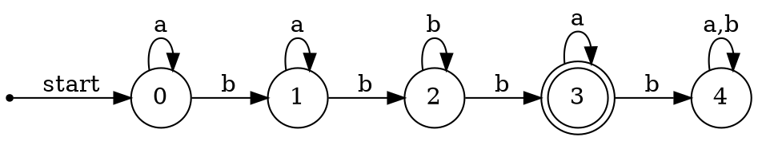
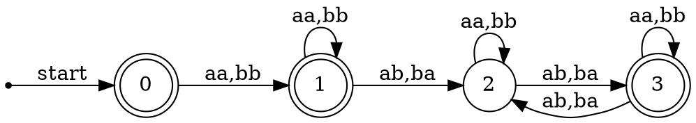
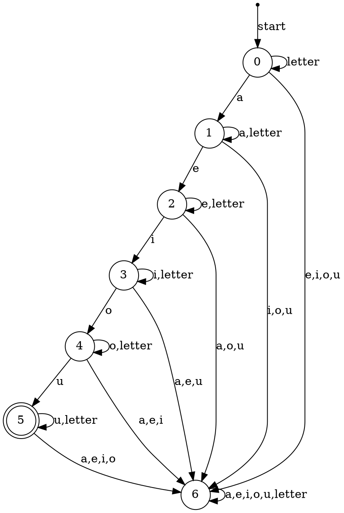
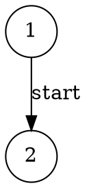

```graphviz
digraph finite_state_machine {
    size="100,100"

    node [shape = point]; i;
    node [shape = doublecircle]; 0;
    node [shape = doublecircle]; 1;
    node [shape = doublecircle]; 2;
    node [shape = doublecircle]; 3;
    node [shape = doublecircle]; 4;
    node [shape = doublecircle]; 5;
    node [shape = doublecircle]; 6;
    node [shape = doublecircle]; 7;
    node [shape = doublecircle]; 8;
    node [shape = doublecircle]; 9;
    node [shape = doublecircle]; 10;
    node [shape = doublecircle]; 11;
    node [shape = doublecircle]; 12;
    node [shape = doublecircle]; 13;
    node [shape = doublecircle]; 14;
    node [shape = doublecircle]; 15;
    node [shape = doublecircle]; 16;
    node [shape = doublecircle]; 17;
    node [shape = doublecircle]; 18;
    node [shape = doublecircle]; 19;
    node [shape = doublecircle]; 21;
    node [shape = doublecircle]; 22;
    node [shape = doublecircle]; 23;
    node [shape = doublecircle]; 24;
    node [shape = doublecircle]; 25;

    node [shape = circle];
    i -> 0 [ label = "start" ];
    1 -> 26 [ label = "a" ];
    2 -> 26 [ label = "a,b" ];
    3 -> 26 [ label = "a,b,c" ];
    4 -> 26 [ label = "a,b,c,d" ];
    5 -> 26 [ label = "a,b,c,d,e" ];
    6 -> 26 [ label = "a,b,c,d,e,f" ];
    7 -> 26 [ label = "a,b,c,d,e,f,g" ];
    8 -> 26 [ label = "a,b,c,d,e,f,g,h" ];
    9 -> 26 [ label = "a,b,c,d,e,f,g,h,i" ];
    10 -> 26 [ label = "a,b,c,d,e,f,g,h,i,j" ];
    11 -> 26 [ label = "a,b,c,d,e,f,g,h,i,j,k" ];
    12 -> 26 [ label = "a,b,c,d,e,f,g,h,i,j,k,l" ];
    13 -> 26 [ label = "a,b,c,d,e,f,g,h,i,j,k,l,m" ];
    14 -> 26 [ label = "a,b,c,d,e,f,g,h,i,j,k,l,m,n" ];
    15 -> 26 [ label = "a,b,c,d,e,f,g,h,i,j,k,l,m,n,o" ];
    16 -> 26 [ label = "a,b,c,d,e,f,g,h,i,j,k,l,m,n,o,p" ];
    17 -> 26 [ label = "a,b,c,d,e,f,g,h,i,j,k,l,m,n,o,p,q" ];
    18 -> 26 [ label = "a,b,c,d,e,f,g,h,i,j,k,l,m,n,o,p,q,r" ];
    19 -> 26 [ label = "a,b,c,d,e,f,g,h,i,j,k,l,m,n,o,p,q,r,s" ];
    20 -> 26 [ label = "a,b,c,d,e,f,g,h,i,j,k,l,m,n,o,p,q,r,s,t" ];
    21 -> 26 [ label = "a,b,c,d,e,f,g,h,i,j,k,l,m,n,o,p,q,r,s,t,u" ];
    22 -> 26 [ label = "a,b,c,d,e,f,g,h,i,j,k,l,m,n,o,p,q,r,s,t,u,v" ];
    23 -> 26 [ label = "a,b,c,d,e,f,g,h,i,j,k,l,m,n,o,p,q,r,s,t,u,v,w" ];
    24 -> 26 [ label = "a,b,c,d,e,f,g,h,i,j,k,l,m,n,o,p,q,r,s,t,u,v,w,x" ];
    25 -> 26 [ label = "a,b,c,d,e,f,g,h,i,j,k,l,m,n,o,p,q,r,s,t,u,v,w,x,y" ];
    26 -> 26 [ label = "letter" ];
    0 -> 0 [ label = "a" ];
    0 -> 1 [ label = "b" ];
    0 -> 2 [ label = "c" ];
    0 -> 3 [ label = "d" ];
    0 -> 4 [ label = "e" ];
    0 -> 5 [ label = "f" ];
    0 -> 6 [ label = "g" ];
    0 -> 7 [ label = "h" ];
    0 -> 8 [ label = "i" ];
    0 -> 9 [ label = "j" ];
    0 -> 10 [ label = "k" ];
    0 -> 11 [ label = "l" ];
    0 -> 12 [ label = "m" ];
    0 -> 13 [ label = "n" ];
    0 -> 14 [ label = "o" ];
    0 -> 15 [ label = "p" ];
    0 -> 16 [ label = "q" ];
    0 -> 17 [ label = "r" ];
    0 -> 18 [ label = "s" ];
    0 -> 19 [ label = "t" ];
    0 -> 20 [ label = "u" ];
    0 -> 21 [ label = "v" ];
    0 -> 22 [ label = "w" ];
    0 -> 23 [ label = "x" ];
    0 -> 24 [ label = "y" ];
    0 -> 25 [ label = "z" ];
    1 -> 1 [ label = "b" ];
    1 -> 2 [ label = "c" ];
    1 -> 3 [ label = "d" ];
    1 -> 4 [ label = "e" ];
    1 -> 5 [ label = "f" ];
    1 -> 6 [ label = "g" ];
    1 -> 7 [ label = "h" ];
    1 -> 8 [ label = "i" ];
    1 -> 9 [ label = "j" ];
    1 -> 10 [ label = "k" ];
    1 -> 11 [ label = "l" ];
    1 -> 12 [ label = "m" ];
    1 -> 13 [ label = "n" ];
    1 -> 14 [ label = "o" ];
    1 -> 15 [ label = "p" ];
    1 -> 16 [ label = "q" ];
    1 -> 17 [ label = "r" ];
    1 -> 18 [ label = "s" ];
    1 -> 19 [ label = "t" ];
    1 -> 20 [ label = "u" ];
    1 -> 21 [ label = "v" ];
    1 -> 22 [ label = "w" ];
    1 -> 23 [ label = "x" ];
    1 -> 24 [ label = "y" ];
    1 -> 25 [ label = "z" ];
    2 -> 2 [ label = "c" ];
    2 -> 3 [ label = "d" ];
    2 -> 4 [ label = "e" ];
    2 -> 5 [ label = "f" ];
    2 -> 6 [ label = "g" ];
    2 -> 7 [ label = "h" ];
    2 -> 8 [ label = "i" ];
    2 -> 9 [ label = "j" ];
    2 -> 10 [ label = "k" ];
    2 -> 11 [ label = "l" ];
    2 -> 12 [ label = "m" ];
    2 -> 13 [ label = "n" ];
    2 -> 14 [ label = "o" ];
    2 -> 15 [ label = "p" ];
    2 -> 16 [ label = "q" ];
    2 -> 17 [ label = "r" ];
    2 -> 18 [ label = "s" ];
    2 -> 19 [ label = "t" ];
    2 -> 20 [ label = "u" ];
    2 -> 21 [ label = "v" ];
    2 -> 22 [ label = "w" ];
    2 -> 23 [ label = "x" ];
    2 -> 24 [ label = "y" ];
    2 -> 25 [ label = "z" ];
    3 -> 3 [ label = "d" ];
    3 -> 4 [ label = "e" ];
    3 -> 5 [ label = "f" ];
    3 -> 6 [ label = "g" ];
    3 -> 7 [ label = "h" ];
    3 -> 8 [ label = "i" ];
    3 -> 9 [ label = "j" ];
    3 -> 10 [ label = "k" ];
    3 -> 11 [ label = "l" ];
    3 -> 12 [ label = "m" ];
    3 -> 13 [ label = "n" ];
    3 -> 14 [ label = "o" ];
    3 -> 15 [ label = "p" ];
    3 -> 16 [ label = "q" ];
    3 -> 17 [ label = "r" ];
    3 -> 18 [ label = "s" ];
    3 -> 19 [ label = "t" ];
    3 -> 20 [ label = "u" ];
    3 -> 21 [ label = "v" ];
    3 -> 22 [ label = "w" ];
    3 -> 23 [ label = "x" ];
    3 -> 24 [ label = "y" ];
    3 -> 25 [ label = "z" ];
    4 -> 4 [ label = "e" ];
    4 -> 5 [ label = "f" ];
    4 -> 6 [ label = "g" ];
    4 -> 7 [ label = "h" ];
    4 -> 8 [ label = "i" ];
    4 -> 9 [ label = "j" ];
    4 -> 10 [ label = "k" ];
    4 -> 11 [ label = "l" ];
    4 -> 12 [ label = "m" ];
    4 -> 13 [ label = "n" ];
    4 -> 14 [ label = "o" ];
    4 -> 15 [ label = "p" ];
    4 -> 16 [ label = "q" ];
    4 -> 17 [ label = "r" ];
    4 -> 18 [ label = "s" ];
    4 -> 19 [ label = "t" ];
    4 -> 20 [ label = "u" ];
    4 -> 21 [ label = "v" ];
    4 -> 22 [ label = "w" ];
    4 -> 23 [ label = "x" ];
    4 -> 24 [ label = "y" ];
    4 -> 25 [ label = "z" ];
    5 -> 5 [ label = "f" ];
    5 -> 6 [ label = "g" ];
    5 -> 7 [ label = "h" ];
    5 -> 8 [ label = "i" ];
    5 -> 9 [ label = "j" ];
    5 -> 10 [ label = "k" ];
    5 -> 11 [ label = "l" ];
    5 -> 12 [ label = "m" ];
    5 -> 13 [ label = "n" ];
    5 -> 14 [ label = "o" ];
    5 -> 15 [ label = "p" ];
    5 -> 16 [ label = "q" ];
    5 -> 17 [ label = "r" ];
    5 -> 18 [ label = "s" ];
    5 -> 19 [ label = "t" ];
    5 -> 20 [ label = "u" ];
    5 -> 21 [ label = "v" ];
    5 -> 22 [ label = "w" ];
    5 -> 23 [ label = "x" ];
    5 -> 24 [ label = "y" ];
    5 -> 25 [ label = "z" ];
    6 -> 6 [ label = "g" ];
    6 -> 7 [ label = "h" ];
    6 -> 8 [ label = "i" ];
    6 -> 9 [ label = "j" ];
    6 -> 10 [ label = "k" ];
    6 -> 11 [ label = "l" ];
    6 -> 12 [ label = "m" ];
    6 -> 13 [ label = "n" ];
    6 -> 14 [ label = "o" ];
    6 -> 15 [ label = "p" ];
    6 -> 16 [ label = "q" ];
    6 -> 17 [ label = "r" ];
    6 -> 18 [ label = "s" ];
    6 -> 19 [ label = "t" ];
    6 -> 20 [ label = "u" ];
    6 -> 21 [ label = "v" ];
    6 -> 22 [ label = "w" ];
    6 -> 23 [ label = "x" ];
    6 -> 24 [ label = "y" ];
    6 -> 25 [ label = "z" ];
    7 -> 7 [ label = "h" ];
    7 -> 8 [ label = "i" ];
    7 -> 9 [ label = "j" ];
    7 -> 10 [ label = "k" ];
    7 -> 11 [ label = "l" ];
    7 -> 12 [ label = "m" ];
    7 -> 13 [ label = "n" ];
    7 -> 14 [ label = "o" ];
    7 -> 15 [ label = "p" ];
    7 -> 16 [ label = "q" ];
    7 -> 17 [ label = "r" ];
    7 -> 18 [ label = "s" ];
    7 -> 19 [ label = "t" ];
    7 -> 20 [ label = "u" ];
    7 -> 21 [ label = "v" ];
    7 -> 22 [ label = "w" ];
    7 -> 23 [ label = "x" ];
    7 -> 24 [ label = "y" ];
    7 -> 25 [ label = "z" ];
    8 -> 8 [ label = "i" ];
    8 -> 9 [ label = "j" ];
    8 -> 10 [ label = "k" ];
    8 -> 11 [ label = "l" ];
    8 -> 12 [ label = "m" ];
    8 -> 13 [ label = "n" ];
    8 -> 14 [ label = "o" ];
    8 -> 15 [ label = "p" ];
    8 -> 16 [ label = "q" ];
    8 -> 17 [ label = "r" ];
    8 -> 18 [ label = "s" ];
    8 -> 19 [ label = "t" ];
    8 -> 20 [ label = "u" ];
    8 -> 21 [ label = "v" ];
    8 -> 22 [ label = "w" ];
    8 -> 23 [ label = "x" ];
    8 -> 24 [ label = "y" ];
    8 -> 25 [ label = "z" ];
    9 -> 9 [ label = "j" ];
    9 -> 10 [ label = "k" ];
    9 -> 11 [ label = "l" ];
    9 -> 12 [ label = "m" ];
    9 -> 13 [ label = "n" ];
    9 -> 14 [ label = "o" ];
    9 -> 15 [ label = "p" ];
    9 -> 16 [ label = "q" ];
    9 -> 17 [ label = "r" ];
    9 -> 18 [ label = "s" ];
    9 -> 19 [ label = "t" ];
    9 -> 20 [ label = "u" ];
    9 -> 21 [ label = "v" ];
    9 -> 22 [ label = "w" ];
    9 -> 23 [ label = "x" ];
    9 -> 24 [ label = "y" ];
    9 -> 25 [ label = "z" ];
    10 -> 10 [ label = "k" ];
    10 -> 11 [ label = "l" ];
    10 -> 12 [ label = "m" ];
    10 -> 13 [ label = "n" ];
    10 -> 14 [ label = "o" ];
    10 -> 15 [ label = "p" ];
    10 -> 16 [ label = "q" ];
    10 -> 17 [ label = "r" ];
    10 -> 18 [ label = "s" ];
    10 -> 19 [ label = "t" ];
    10 -> 20 [ label = "u" ];
    10 -> 21 [ label = "v" ];
    10 -> 22 [ label = "w" ];
    10 -> 23 [ label = "x" ];
    10 -> 24 [ label = "y" ];
    10 -> 25 [ label = "z" ];
    11 -> 11 [ label = "l" ];
    11 -> 12 [ label = "m" ];
    11 -> 13 [ label = "n" ];
    11 -> 14 [ label = "o" ];
    11 -> 15 [ label = "p" ];
    11 -> 16 [ label = "q" ];
    11 -> 17 [ label = "r" ];
    11 -> 18 [ label = "s" ];
    11 -> 19 [ label = "t" ];
    11 -> 20 [ label = "u" ];
    11 -> 21 [ label = "v" ];
    11 -> 22 [ label = "w" ];
    11 -> 23 [ label = "x" ];
    11 -> 24 [ label = "y" ];
    11 -> 25 [ label = "z" ];
    12 -> 12 [ label = "m" ];
    12 -> 13 [ label = "n" ];
    12 -> 14 [ label = "o" ];
    12 -> 15 [ label = "p" ];
    12 -> 16 [ label = "q" ];
    12 -> 17 [ label = "r" ];
    12 -> 18 [ label = "s" ];
    12 -> 19 [ label = "t" ];
    12 -> 20 [ label = "u" ];
    12 -> 21 [ label = "v" ];
    12 -> 22 [ label = "w" ];
    12 -> 23 [ label = "x" ];
    12 -> 24 [ label = "y" ];
    12 -> 25 [ label = "z" ];
    13 -> 13 [ label = "n" ];
    13 -> 14 [ label = "o" ];
    13 -> 15 [ label = "p" ];
    13 -> 16 [ label = "q" ];
    13 -> 17 [ label = "r" ];
    13 -> 18 [ label = "s" ];
    13 -> 19 [ label = "t" ];
    13 -> 20 [ label = "u" ];
    13 -> 21 [ label = "v" ];
    13 -> 22 [ label = "w" ];
    13 -> 23 [ label = "x" ];
    13 -> 24 [ label = "y" ];
    13 -> 25 [ label = "z" ];
    14 -> 14 [ label = "o" ];
    14 -> 15 [ label = "p" ];
    14 -> 16 [ label = "q" ];
    14 -> 17 [ label = "r" ];
    14 -> 18 [ label = "s" ];
    14 -> 19 [ label = "t" ];
    14 -> 20 [ label = "u" ];
    14 -> 21 [ label = "v" ];
    14 -> 22 [ label = "w" ];
    14 -> 23 [ label = "x" ];
    14 -> 24 [ label = "y" ];
    14 -> 25 [ label = "z" ];
    15 -> 15 [ label = "p" ];
    15 -> 16 [ label = "q" ];
    15 -> 17 [ label = "r" ];
    15 -> 18 [ label = "s" ];
    15 -> 19 [ label = "t" ];
    15 -> 20 [ label = "u" ];
    15 -> 21 [ label = "v" ];
    15 -> 22 [ label = "w" ];
    15 -> 23 [ label = "x" ];
    15 -> 24 [ label = "y" ];
    15 -> 25 [ label = "z" ];
    16 -> 16 [ label = "q" ];
    16 -> 17 [ label = "r" ];
    16 -> 18 [ label = "s" ];
    16 -> 19 [ label = "t" ];
    16 -> 20 [ label = "u" ];
    16 -> 21 [ label = "v" ];
    16 -> 22 [ label = "w" ];
    16 -> 23 [ label = "x" ];
    16 -> 24 [ label = "y" ];
    16 -> 25 [ label = "z" ];
    17 -> 17 [ label = "r" ];
    17 -> 18 [ label = "s" ];
    17 -> 19 [ label = "t" ];
    17 -> 20 [ label = "u" ];
    17 -> 21 [ label = "v" ];
    17 -> 22 [ label = "w" ];
    17 -> 23 [ label = "x" ];
    17 -> 24 [ label = "y" ];
    17 -> 25 [ label = "z" ];
    18 -> 18 [ label = "s" ];
    18 -> 19 [ label = "t" ];
    18 -> 20 [ label = "u" ];
    18 -> 21 [ label = "v" ];
    18 -> 22 [ label = "w" ];
    18 -> 23 [ label = "x" ];
    18 -> 24 [ label = "y" ];
    18 -> 25 [ label = "z" ];
    19 -> 19 [ label = "t" ];
    19 -> 20 [ label = "u" ];
    19 -> 21 [ label = "v" ];
    19 -> 22 [ label = "w" ];
    19 -> 23 [ label = "x" ];
    19 -> 24 [ label = "y" ];
    19 -> 25 [ label = "z" ];
    20 -> 20 [ label = "u" ];
    20 -> 21 [ label = "v" ];
    20 -> 22 [ label = "w" ];
    20 -> 23 [ label = "x" ];
    20 -> 24 [ label = "y" ];
    20 -> 25 [ label = "z" ];
    21 -> 21 [ label = "v" ];
    21 -> 22 [ label = "w" ];
    21 -> 23 [ label = "x" ];
    21 -> 24 [ label = "y" ];
    21 -> 25 [ label = "z" ];
    22 -> 22 [ label = "w" ];
    22 -> 23 [ label = "x" ];
    22 -> 24 [ label = "y" ];
    22 -> 25 [ label = "z" ];
    23 -> 23 [ label = "x" ];
    23 -> 24 [ label = "y" ];
    23 -> 25 [ label = "z" ];
    24 -> 24 [ label = "y" ];
    24 -> 25 [ label = "z" ];
    25 -> 25 [ label = "z" ];
}

```

3.3.3 试说明在一个长度为n的字符串中，分别有多少个
1) 前缀
2) 后缀
3) 真前缀
4) 子串
5) 子序列

解：
1) 前缀长度可以从0增加至n，每个长度下有且仅仅有一个，所以有$n+1$个前缀  
2) 后缀长度可以从0增加至n，每个长度下有且仅仅有一个，有$n+1$个后缀
3) 真前缀长度不可等于原来的字符串，也不可为$\epsilon$ ，所以有$n-1$个真前缀
4) 子串长度可以从0增加至n，设每个长度x下的子串有l(x)个，总的子串数为L,则
$$
L =
\begin{cases}
1, & n = 0 \\
1+\sum _{x=1} ^n {(n-x+1)} &,n > 1
\end{cases} 
=
\begin{cases}
1, & n = 0 \\
= 1+n^2- \sum_{x=1}^n{x}+n &,n > 1
\end{cases}\\    
=
\begin{cases}
1, & n = 0 \\
1+n^2 - \frac 1 2 {n(n+1)} + n &,n > 1
\end{cases}\\    
=
\begin{cases}
1, & n = 0 \\
1 + \frac 1 2 n(n+1)   &,n > 1
\end{cases}\\$$
5) 原字符串中每个位均可在子序列中出现，所以有$2^n$个子序列

3.3.4 很多语言都是大小写敏感的（case sensitive），因为这些语言的关键字只能有一种写法，描述这些关键字的词素的正则表达式就很简单，但是，像SQL这样的语言是大小写不敏感的（case insensitive），一个关键字既可以大写，也可以小写，还可以大小写混用。因此SQL中的关键词SELECT可以写成select、Select或sElEcT。请描述出如何用正则表达式来表示大小写不敏感的语言中的关键字。给出SQL语言的关键字select的表达式，以说明你的的思想。

解：(S|s)(E|e)(L|l)(E|e)(C|c)(T|t)

3.3.5 试写出下列语言的正则定义：
1) 包含5个元音的所有小写字母串，这些串中的元音按顺序出现
2) 所有按词典递增序排列的小写字母组成的串
3) 注释即/\*和*/之间的串，且串中没有不在双引号(")中的*/
4) 所有不重复的数位组成的串。提示：首先尝试解决只含有少量数位（比如|0，1，2|）的数位串
5) 所有最多只有一个重复数位的串
6) 所有由偶数个a和奇数个b构成的串
7) 以非正式方式表示的国际象棋的步法的集合，如p-k4或kbp×qn
8) 所有由a和b组成且不含子串abb的串
9) 所有由a和b组成且不含子序列abb的串

解：
1) $$
    letter \rightarrow [b-df-hj-np-tv-z]^*\\
    L \rightarrow letter \ a^+ \  letter\ e^+ \  letter \ i^+ \ letter\ o^+ \ letter\ u^+ \ letter
$$
2) 
$$ 
    L \rightarrow a^* b^* c^* d^* e^* f^* g^* h^* i^* j^* k^* l^* m^* n^* o^* p^* q^* m^* n^* o^* p^* q^* r^* s^* t^* u^* v^* w^* x^* y^* z^*
$$ 

3) 
$$
    begin \rightarrow /* \\
    end \rightarrow */  \\
    letter_digit \rightarrow [A-Za-z0-9] \\
    quote \rightarrow ' \\
    dquote \rightarrow " \\
    plus \rightarrow  + \\
    minus \rightarrow - \\
    star \rightarrow * \\
    div \rightarrow / \\
    equal \rightarrow = \\
    lparenthesis \rightarrow ( \\
    rparenthesis \rightarrow ) \\
    lbracket  \rightarrow [   \\
    rbracket  \rightarrow ]   \\
    percent \rightarrow \% \\
    dollar \rightarrow \$ \\
    L \rightarrow begin (letter_digit|'end'|quote|dquote|plus|minus|star|div|equal|lparenthesis|rparenthesis|lbracket|rbracket|!|@|_|dollar|percent|~|)^* end
$$
4) $$
    1digit0 = 0?\\
    1digit1 = 1?\\
    1digit2 = 2?\\
    1digit3 = 3?\\
    1digit4 = 4?\\
    1digit5 = 5?\\
    1digit6 = 6?\\
    1digit7 = 7?\\
    1digit8 = 8?\\
    1digit9 = 9?\\
    2digit1 = 0?1?\\
    2digit2 = 0?2?\\
    
    10digit0 \rightarrow 0?[1-9]?
$$
5) $$

$$
6) $$
    L \rightarrow ((aa)?)^*b((bb)?)^*      
$$

7) $$

$$

8) $$
    L \rightarrow  (a^*|b^*)(aba?)^*a^*
$$

9) $$
    L \rightarrow  b^*a^*b?
$$

3.3.6 为下列的字符集合写出对应的字符类。  
1) 英文字母的前10个字母（从a到j）,包括大写和小写
2) 所有小写的辅音字母的集合
3) 十六进制中的“数位”（对大于9的数位，自己决定大小写）
4) 可以出现在一个合法的英文句子后面的字符集，比如感叹号。
   
解：
1) [A-Ja-j]
2) {b,c,d,f,g,h,j,k,l,m,n,p,q,r,s,t,v,w,x,y,z}
3) 0,1,2,3,4,5,6,7,8,9,a,b,c,d,e,f
4) 
{
    句点：英国英语（BrE）：Full Stop；美国英语（AmE）：Period，“.”  
    问号：Question Mark，“ ? ”  
    感叹号：Exclamation Mark，“!”  
    逗号：Comma，“ , ”
    冒号：Colon，“  : ”  
    省略号：Ellipsis (众数：Ellipses)，“ ... ”  
    分号：Semicolon，“ ; ”  
    连字符：Hyphen，“ - ”  
    连接号：En Dash，“ – ”  
    破折号：Em Dash，“ — ”  
    括号：Parentheses，  
    小括号（圆括号）“ ( ) ”（parenthesis; round brackets）；  
    中括号“ [ ] ”（square brackets）；  
    大括号“ { } ”（brackets; braces）  
    引号：Quotation Marks，  
    双引号“ " ”（quote）；  
    单引号“ ' ”（single quotation marks）
    缩写及所有格符号：Apostrophe，“ ' ”
}

3.3.7 请注意这些正则表达式中的下列字符（称为运算符字符）都具有特殊的含义：  

        \ " . ^ $ [ ] * + ? { } | /   

如果想要使得这些特殊字符在一个串中表示它们本身，就必须取消它们的特殊含义。我们将它们放置在一个长度大于等于1且加上双引号的串中就可以取消特殊含义。例如，正则表达式"**"和字符串**匹配。我们也可以在一个运算符字符前加一个反斜线，得到这个字符的字面含义。那么，正则表达式\*\*也和串**匹配。请写出一个和字符串"\匹配的正则表达式  

解：\\"\\\\

3.3.8 在Lex中，补集字符类（complemented character class）代表该子父类中列出的字符之外的所有字符。我们将^放在开头来表示一个补集字符类。除非^在该字符类内列出，否则这个字符不在被取补的字符类中。因此，[^A-Za*z]匹配所有不是大小写字母的字符，[^\^]匹配除^（以及换行符，因为它不在任何字符类中）之外的任何字符。试证明：对于每个带有补集字符类的正则表达式，都存在一个等价的不含补集字符类的正则表达式。  
证明：任取一个带有补集字符类的正则表达式，可将其中的补集字符类替换为一个组成字符为字母表中不在该字符类中的全体字符组成的字符类，即可得到一个等价的不含补集字符类的正则表达式

3.3.9: 正则表达式r{m,n}和模式r的m到n次重复出现相匹配。例如，a{1,5}和由1~5个a组成的串匹配。试证明：对于每一个包含这种形式的重复运算符的正则表达式，都存在一个等价的不包含重复运算符的正则表达式。  
证明：
定义$S(n)$为n个S连接形成的正则表达式，其中S为任意正则表达式
1.任取一个上述这种形式的重复运算符的正则表达式r=s{m,n}，则
$$
    r=s(m)|s(m+1)|...|s(n)
$$
2.若x中不包含上述这种形式的重复运算符则问题得证，否则，对s中包含的形如b{x,y}形式的重复运算符子表达式a，可将其替换为
$$
    a=b(x)|b(x+1)|...|b(y)
$$
3.重复上述过程直至表达式中不含重复运算符，问题即可得证

3.3.10: 运算符^匹配一行的最左端，$匹配一行的最右端。运筛符^也被用作补集字符类的首字符，但是通过上下文总是能够确定它的含义。例如，^[^aeiou]*\$匹配任何一个不包
含小写元音字符的行。  
l) 你怎样判断^到底表示哪一个意思？  
2) 是否总是能够将一个包括^和\$运算符的正则表达式替换为一个等价的不包含这些运算符的正则表达式？  
解：
1) 可以规定出现在[]中第一个[之后的^代表补集字符类的首字符，出现在其余位置匹配一行的最左端
2) 不可以，匹配首行的^无法用字符标识
   
3.3.11: UNIX的shell命令sh在文件名表达式中使用下表中的运算符来描述文件名的集合。例如，文件名表达式*.o和所有以.o结束的文件名匹配；sort1.?和所有形如sort1.c的文件名匹配，其中c可以是任何字符。试问如何使用只包含并、连接和闭包运算符的正则表达式来表示sh文件名表达式？  
|表达式|匹配|例子|
|----|-----|----|
|'s'|串s的字面值|'\\'|
|\c|字符c的字面值|\\'|
|*|任何串|*.o|
|?|任何字符|sort1.?|
|[s]|s中的任何字符|sort1.[cso]|
解：
$$
    letter \rightarrow A|...|Z|a|...|z\\
    digit \rightarrow 0|...|9\\
    symbol \rightarrow \_|-|=|+|.|!|\&|(|){|}|[|]|'|"|;|:|~|\#|@|\%\\
    s \rightarrow (letter|digit|symbol)*\\
    \\'s' \rightarrow s\\
    char \rightarrow letter|digit|symbol\\
    char  \rightarrow char\\
    name \rightarrow (s|string)*\\
    ? \rightarrow char\\
    * \rightarrow name\\
    [s] \rightarrow name
$$
练习3.3.12: SQL语言支持一种不成熟的模式描述方式，其中有两个具有特殊含义的字符；下划线(_)表示任意一个字符；百分号\%表示包含0个或多个字符的串。此外，程序员还可以将任意一个字符（比如e) 定义为转义字符。那么，在_、\%或者另一个e之前加上一个e, 就使得这个字符只表示它的字面值。假设我们巳经知道哪个字符是转义字符，说明如何将任意SQL模式表示为一个正则表达式。
解：
$$
    letter \rightarrow A|...|Z|a|...|z\\
    digit \rightarrow 0|...|9\\
    symbol \rightarrow e\_|-|=|+|.|!|\&|(|){|}|[|]|'|"|;|:|~|\#|@|e\% \\
    \_ \rightarrow letter|digit|symbol\\
    \% \rightarrow (letter|digit|symbol)*\\
    SQL \rightarrow \_\%
$$

3.4.1: 给出识别练习3.3.2中各个正则表达式所描述的语言的状态转换图。  
解：  
1)a (a | b)* a

2)(($\epsilon$ | a) b*)*

3) (a|b)*a(a|b)(a|b)

4) a*ba*ba*ba*

5) (aa | bb)* ((ab | ba) (aa | bb)* (ab | ba) (aa | bb)*)*

3.4.2: 给出识别练习3.3.5中各个正则表达式所描述的语言的状态转换图。
解：
1) $$
    letter \rightarrow [b-df-hj-np-tv-z]^*\\
    L \rightarrow letter \ a^+ \  letter\ e^+ \  letter \ i^+ \ letter\ o^+ \ letter\ u^+ \ letter
$$

2) 
$$ 
    L \rightarrow a^* b^* c^* d^* e^* f^* g^* h^* i^* j^* k^* l^* m^* n^* o^* p^* q^* m^* n^* o^* p^* q^* r^* s^* t^* u^* v^* w^* x^* y^* z^*
$$ 

3) 
$$
    begin \rightarrow /* \\
    end \rightarrow */  \\
    letter_digit \rightarrow [A-Za-z0-9] \\
    quote \rightarrow ' \\
    dquote \rightarrow " \\
    plus \rightarrow  + \\
    minus \rightarrow - \\
    star \rightarrow * \\
    div \rightarrow / \\
    equal \rightarrow = \\
    lparenthesis \rightarrow ( \\
    rparenthesis \rightarrow ) \\
    lbracket  \rightarrow [   \\
    rbracket  \rightarrow ]   \\
    percent \rightarrow \% \\
    dollar \rightarrow \$ \\
    L \rightarrow begin (letter_digit|'end'|quote|dquote|plus|minus|star|div|equal|lparenthesis|rparenthesis|lbracket|rbracket|!|@|_|dollar|percent|~|)^* end
$$

4) $$
    1digit0 = 0?\\
    1digit1 = 1?\\
    1digit2 = 2?\\
    1digit3 = 3?\\
    1digit4 = 4?\\
    1digit5 = 5?\\
    1digit6 = 6?\\
    1digit7 = 7?\\
    1digit8 = 8?\\
    1digit9 = 9?\\
    2digit1 = 0?1?\\
    2digit2 = 0?2?\\
    
    10digit0 \rightarrow 0?[1-9]?
$$
5) $$

$$
6) $$
    L \rightarrow ((aa)?)^*b((bb)?)^*      
$$

7) $$

$$

8) $$
    L \rightarrow  (a^*|b^*)(aba?)^*a^*
$$

9) $$
    L \rightarrow  b^*a^*b?
$$